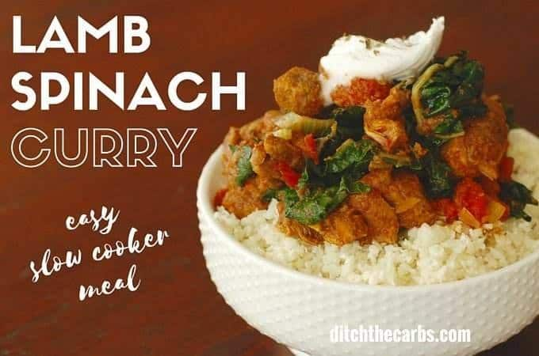

Lamb curry with spinach - Saag Gosht
=====================================

Good source of :ref:`protein-label`

https://www.ditchthecarbs.com/lamb-curry-spinach-saag-gosht/

Ingredients:
------------

* 1 red onion quartered and sliced
* 2 cloves garlic crushed
* 2 tbsp ginger crushed
* 2 tsp cardamon
* 6 cloves whole
* 2 tsp coriander ground
* 1 tsp turmeric powder
* 1/2 tsp chilli powder
* 1 tsp garam masala powder
* 2 tsp cumin powder
* 500 g cubed lamb
* 500 g packet frozen spinach
* 400 g tinned/canned tomatoes chopped

Instructions:
-------------

#. Defrost the spinach in the microwave, then squeeze handfuls to get out the excess water (don't squeeze too hard and make it dry).
#. Place all the ingredients in the slow cooker, stir.
#. Cook on HIGH for 4-5 hours or LOW for 8 hours.

Nutritional values/serving:
---------------------------

* serving size: 6

===================   ================
Group                 Amount
===================   ================
Calories              158 kcal
Calories from fat     57 kcal
Total carbs           7.7 g   
Fiber                 3.8 g
Sugar                 3.6 g             
Protein               20.3 g
Fat                   6.3 g
===================   ================

